## Objective

The objective of this phase was to transform the prepared dataset into a structured Data Warehouse optimized for Business Intelligence and reporting.

Using SQL Server, the raw data was processed through an ETL workflow, organized into a Star Schema, and stored in dimension and fact tables. Relationships, indexes, and validation procedures were implemented to ensure data integrity, optimize query performance, and provide a scalable foundation for Power BI dashboards.

---

## Preprocessing

Before importing the dataset into SQL Server, a light preprocessing step was performed to improve data consistency while preserving the original dataset.

The original CSV file was kept unchanged as a backup, and a working copy was created for the ETL process. During this step, the `Year` column was removed because its values could be derived directly from the `OrderDate` field, eliminating redundant information and following database normalization principles.

This preprocessing ensured that the dataset was clean, consistent, and ready for the Data Warehouse implementation without altering the original source data.

<p>

<p align="center">
    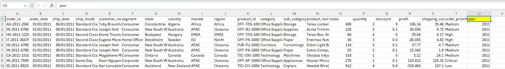
</p>

<p align="center">
<i>Figure 1. Before Preprocessing.</i>
</p>

<p align="center">
    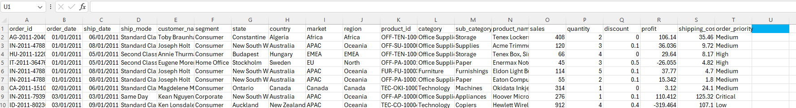
</p>

<p align="center">
<i>Figure 1.1 After Preprocessing.</i>
</p>

---

## SQL Server Environment

Microsoft SQL Server was selected as the database management system for implementing the Data Warehouse due to its reliability, scalability, and strong integration with Business Intelligence tools.

SQL Server Management Studio (SSMS) was used to design the database, execute SQL scripts, manage objects, and validate the ETL process. This environment provided the necessary tools to efficiently build and maintain the relational data model that would later be connected to Power BI for reporting and analysis.

<p align="center">
    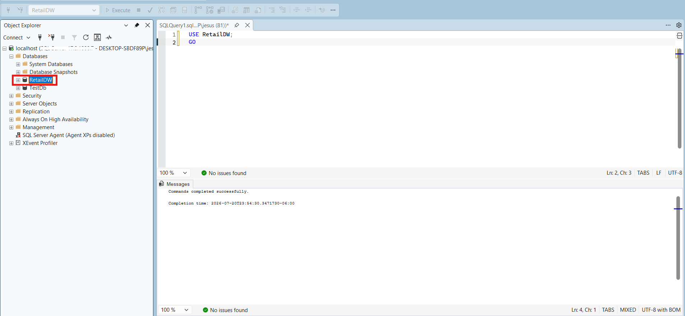>
</p>

<p align="center">
<i>Figure 3. SQL Server Management Studio (SSMS) environment used to develop the Data Warehouse.</i>
</p>

---

## Database Creation

A dedicated database named `RetailDW` was created to store and manage the Data Warehouse objects.

Creating a separate database provides better organization, simplifies maintenance, and isolates analytical workloads from operational systems. This approach follows common data warehousing best practices by keeping the analytical environment independent from the original data source.

This database serves as the foundation for all subsequent components, including schemas, staging tables, dimension tables, fact tables, and ETL processes.

<p align="center">
    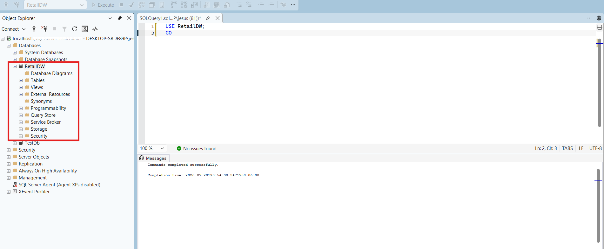>
</p>

<p align="center">
<i>Figure 4. Creation of the RetailDW database in SQL Server.</i>
</p>

---

## Schema Design

To improve organization and maintainability, the database was divided into separate schemas based on the role of each object within the Data Warehouse architecture.

Three schemas were created:

- **stg**: Stores the raw data imported from the source file before transformation.
- **dim**: Contains dimension tables that describe business entities such as customers, products, and locations.
- **fact**: Contains the fact table, which stores measurable business events and references the dimension tables through foreign keys.

Separating objects into schemas improves readability, simplifies administration, and follows common data warehousing best practices.

```sql
CREATE SCHEMA stg;
GO

CREATE SCHEMA dim;
GO

CREATE SCHEMA fact;
GO
```

<p align="center">
    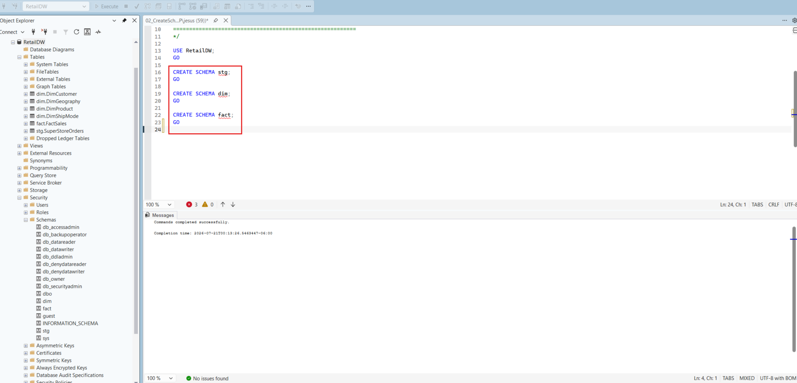>
</p>

<p align="center">
<i>Figure 5. Database schemas used to organize the Data Warehouse objects.</i>
</p>

> **💡 Design Insight**
>
> **Why use separate schemas instead of storing all tables under `dbo`?**
>
> Using dedicated schemas improves database organization by grouping objects according to their purpose. It also simplifies maintenance, enhances security management through schema-level permissions, and makes the Data Warehouse easier to scale as new objects are added. This logical separation is considered a best practice in enterprise database design.

---

## Staging Layer

A staging layer was implemented to serve as the initial landing area for the raw data imported from the CSV file.

The staging table preserves the original structure of the dataset, allowing the data to be validated, transformed, and cleansed before being loaded into the dimensional model. Keeping the staging layer separate from the analytical tables reduces the risk of data inconsistencies and provides a controlled environment for the ETL process.

For this project, the source data was imported into the `stg.SuperStore` table, which became the starting point for all subsequent transformations.

```sql
CREATE TABLE stg.SuperStore (
    OrderID NVARCHAR(50),
    OrderDate DATE,
    ShipDate DATE,
    CustomerID NVARCHAR(50),
    ProductID NVARCHAR(50),
    Sales DECIMAL(10,2),
    Quantity INT,
    Profit DECIMAL(10,2)
    -- Additional columns...
);
```

<p align="center">
    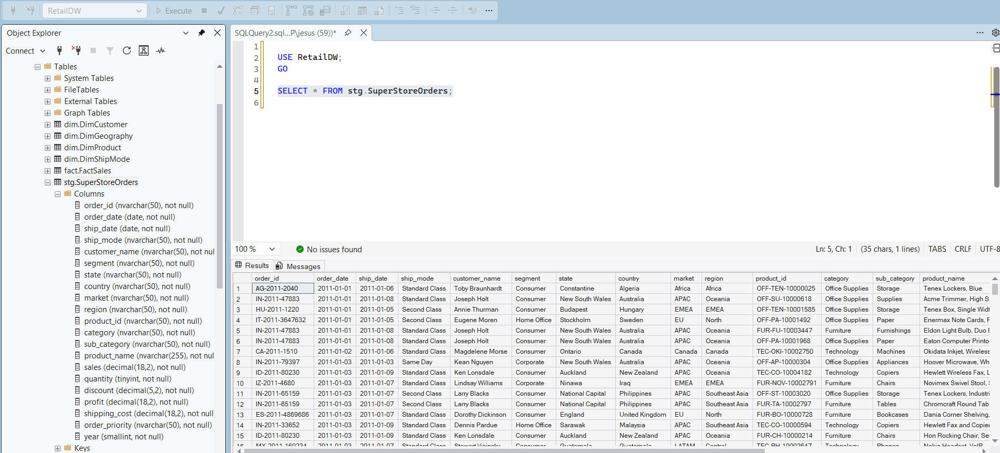>
</p>

<p align="center">
<i>Figure 6. Staging table containing the raw data imported from the source CSV file.</i>
</p>

> **💡 Design Insight**
>
> **Why use a staging layer instead of loading data directly into the dimension and fact tables?**
>
> A staging layer isolates the raw source data from the analytical model, making the ETL process safer and easier to manage. It allows data quality checks, transformations, and validation to be performed before loading the final tables, reducing the risk of introducing inconsistent or incomplete data into the Data Warehouse.

### 📌 Key Takeaways

- The staging layer is the first destination for the raw source data.
- It preserves the original dataset before any transformation is applied.
- Data validation and cleansing are performed before loading the dimensional model.
- Separating staging from analytical tables improves data quality and simplifies ETL maintenance.
- This approach follows common Data Warehouse and ETL best practices.

---

## ETL Process

The ETL (Extract, Transform, Load) process was implemented to transfer data from the staging layer into the dimensional model.

During the **Extract** phase, the source CSV file was imported into the `stg.SuperStore` staging table, preserving the original dataset before any modifications were applied.

In the **Transform** phase, the data was cleaned and prepared for analytical use. Redundant attributes were removed, data types were standardized, surrogate keys were generated for dimension tables, and the records were structured according to the Star Schema design.

Finally, during the **Load** phase, the transformed data was inserted into the dimension tables followed by the `fact.FactSales` table. This loading sequence ensured referential integrity by guaranteeing that all foreign key references already existed in their corresponding dimensions.

The ETL workflow produced a clean, consistent, and analytics-ready dataset that serves as the foundation for Power BI dashboards and business reporting.

```sql
INSERT INTO dim.DimCustomer (
    CustomerID,
    CustomerName,
    Segment
)
SELECT DISTINCT
    CustomerID,
    CustomerName,
    Segment
FROM stg.SuperStore;
```

<p align="center">
    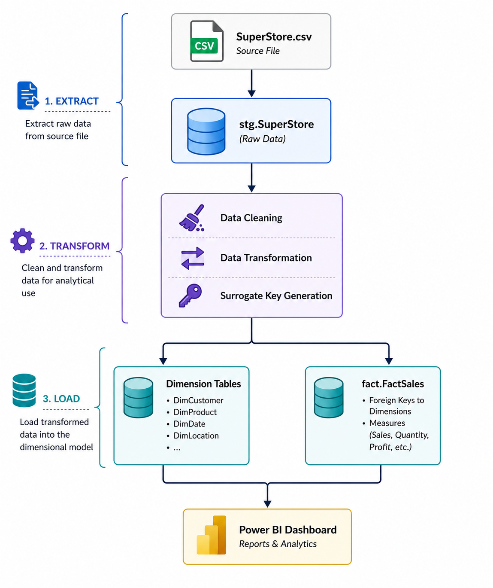
</p>

<p align="center">
<i>Figure 7. ETL workflow from the source dataset to the Star Schema.</i>
</p>

> **💡 Design Insight**
>
> **Why separate the ETL process into Extract, Transform, and Load phases?**
>
> Dividing the workflow into distinct phases makes the data pipeline easier to maintain, troubleshoot, and scale. It also allows each stage to focus on a specific responsibility: extracting raw data, transforming it into a business-friendly format, and loading it into the analytical model while preserving data integrity.

### 📌 Key Takeaways

- Data was extracted from the source CSV into the staging layer.
- Data cleansing and business transformations were applied before loading.
- Dimension tables were populated before the fact table.
- Referential integrity was maintained throughout the loading process.
- The ETL pipeline produced a reliable dataset optimized for Business Intelligence.

---

## Star Schema Design

A Star Schema was selected as the dimensional model for this project because it provides a simple, efficient, and scalable structure for Business Intelligence workloads.

The model consists of a central fact table (`fact.FactSales`) surrounded by multiple dimension tables that describe the business entities involved in each sales transaction. This design minimizes the number of joins required for analytical queries, improving performance and simplifying report development in Power BI.

The implemented Star Schema includes four dimension tables:

- **dim.DimCustomer**
- **dim.DimProduct**
- **dim.DimGeography**
- **dim.DimShipMode**

These dimensions are linked to the central `fact.FactSales` table through surrogate keys, creating a clean and optimized analytical model.

<p align="center">
    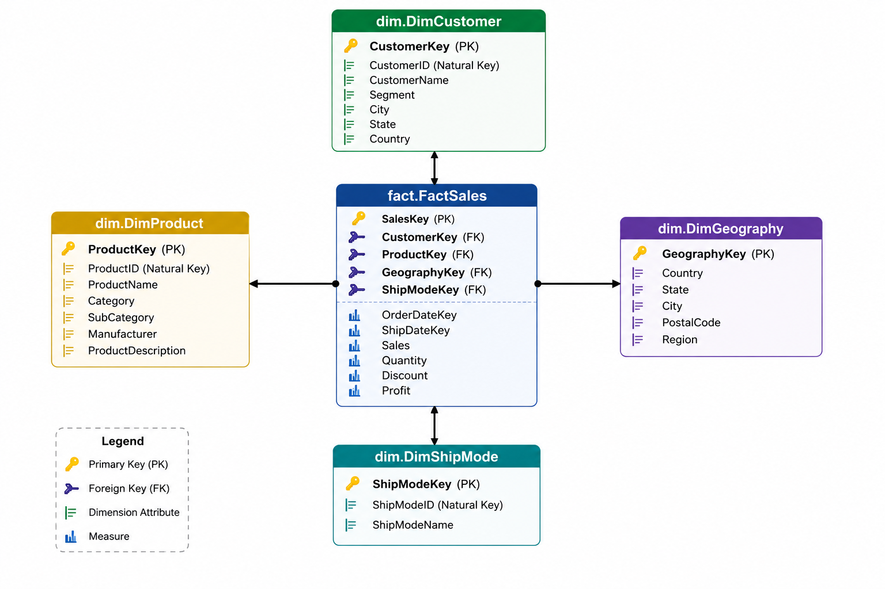
</p>

<p align="center">
<i>Figure 8. Star Schema implemented for the Retail Data Warehouse.</i>
</p>

> **💡 Design Insight**
>
> **Why choose a Star Schema instead of a fully normalized database?**
>
> Star Schemas are specifically designed for analytical workloads rather than transactional systems. By denormalizing descriptive attributes into dimension tables, analytical queries require fewer joins, execute faster, and are easier to understand. This structure is widely adopted in modern Business Intelligence and Data Warehouse solutions because it balances performance, simplicity, and scalability.

### 📌 Key Takeaways

- The Star Schema separates measurable data from descriptive data.
- `fact.FactSales` is the central table containing business metrics.
- Dimension tables provide business context for analysis.
- Surrogate keys simplify relationships and improve performance.
- The model is optimized for Power BI and analytical queries.

---

## Dimension Tables

Dimension tables store descriptive business information that provides context for the numerical values contained in the fact table. Instead of storing repetitive descriptive data with every transaction, the Data Warehouse separates this information into dedicated dimensions, reducing redundancy and improving query performance.

Each dimension is assigned a surrogate key that is referenced by the central fact table, allowing efficient joins while preserving a clean and scalable dimensional model.

The project includes four dimension tables:

| Dimension | Purpose |
|-----------|---------|
| **dim.DimCustomer** | Stores customer information such as customer name and market segment. |
| **dim.DimProduct** | Contains product-related attributes including category, subcategory, and product name. |
| **dim.DimGeography** | Stores geographic information including country, state, city, and region. |
| **dim.DimShipMode** | Stores shipping methods used for order deliveries. |

<p align="center">
    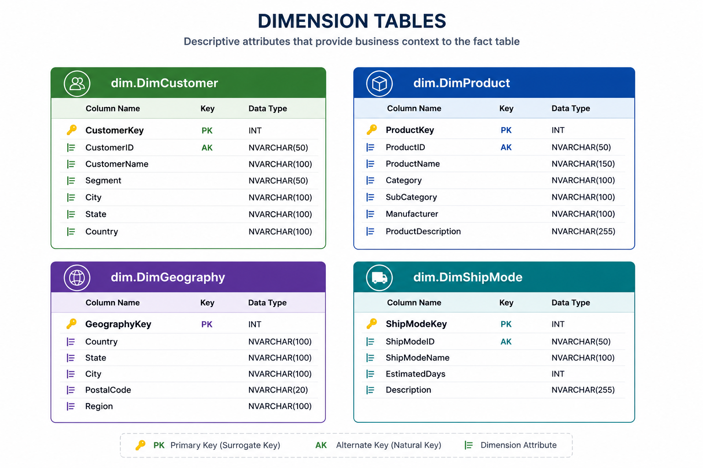
</p>

<p align="center">
<i>Figure 9. Dimension tables implemented in the Retail Data Warehouse.</i>
</p>

> **💡 Design Insight**
>
> Dimension tables provide the descriptive context required for business analysis. By isolating attributes such as customers, products, locations, and shipping methods from transactional records, the model becomes easier to maintain, reduces data duplication, and enables flexible slicing and filtering in analytical reports.

### 📌 Key Takeaways

- Dimension tables contain descriptive business attributes.
- Each dimension is uniquely identified by a surrogate key.
- Dimensions eliminate redundant descriptive data from the fact table.
- The model enables flexible filtering and drill-down analysis in Power BI.

---

## Fact Table

The fact table serves as the central component of the Star Schema, storing the measurable business events that are analyzed throughout the reporting process.

Each record in `fact.FactSales` represents a sales transaction and references the corresponding dimension tables through surrogate keys. This design enables efficient aggregation and filtering across multiple business perspectives, such as customer, product, geography, and shipping method.

The table contains both foreign keys and quantitative measures that support analytical reporting in Power BI.

| Category | Attributes |
|----------|------------|
| **Primary Key** | SalesKey |
| **Foreign Keys** | CustomerKey, ProductKey, GeographyKey, ShipModeKey |
| **Dates** | OrderDate, ShipDate |
| **Business Measures** | Sales, Quantity, Discount, Profit, ShippingCost |

<p align="center">
    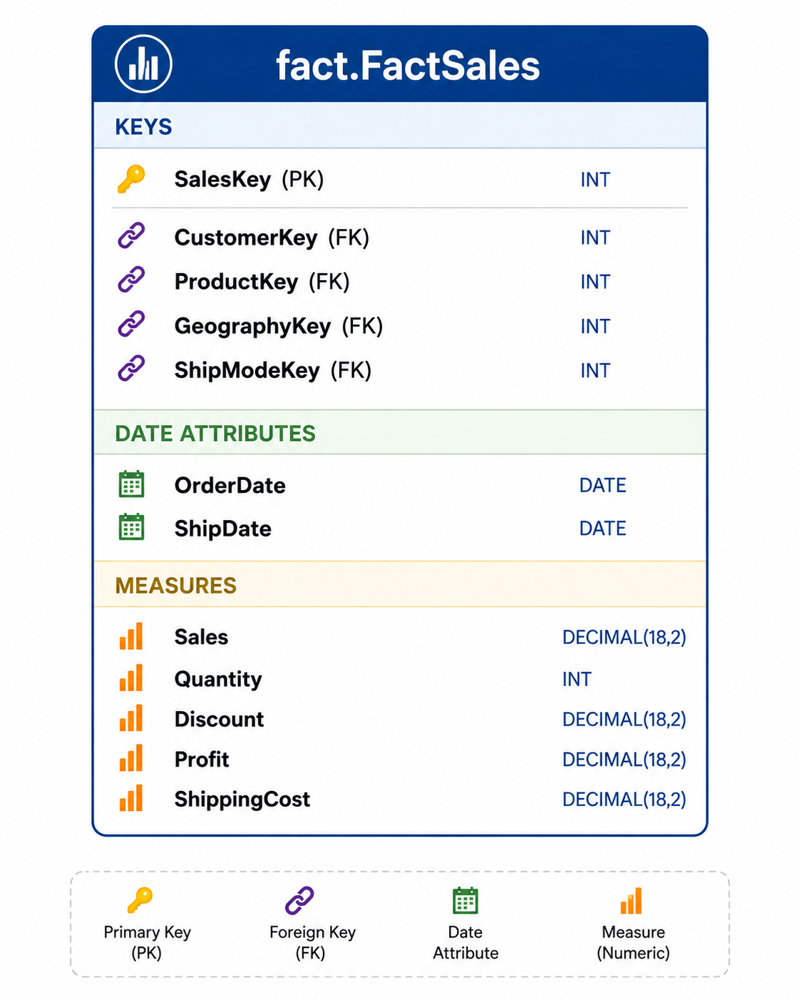
</p>

<p align="center">
<i>Figure 10. Structure of the FactSales table.</i>
</p>

> **💡 Design Insight**
>
> Unlike dimension tables, which describe business entities, the fact table stores measurable business metrics. Keeping numerical values centralized allows analytical tools such as Power BI to efficiently aggregate data while leveraging the descriptive context provided by dimension tables.

### 📌 Key Takeaways

- The fact table is the center of the Star Schema.
- Each record represents a business transaction.
- Foreign keys connect every sale to its descriptive dimensions.
- Business measures support aggregations, KPIs, and dashboards.
- The structure is optimized for analytical queries and reporting.

---

## Data Validation

After loading the dimensional model, a series of validation checks were performed to verify the accuracy and consistency of the Data Warehouse.

The validation process focused on ensuring that the ETL pipeline correctly transferred data from the staging layer into the dimension and fact tables without introducing missing records, duplicate entries, or broken relationships.

The following validations were performed:

- Record count verification between the staging and destination tables.
- Duplicate record detection in dimension tables.
- Primary key uniqueness verification.
- Foreign key relationship validation.
- Manual inspection of sample records to confirm data accuracy.

<p align="center">
    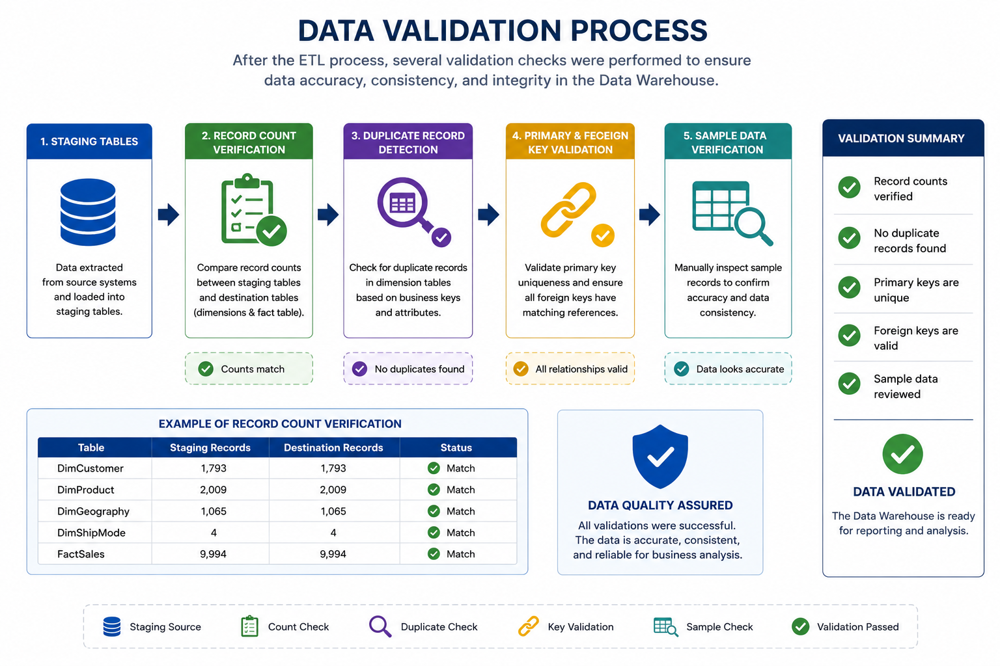
</p>

<p align="center">
<i>Figure 11. Data validation performed after the ETL process.</i>
</p>

> **💡 Design Insight**
>
> Data validation is a critical step in every ETL pipeline. Verifying data quality before building dashboards ensures that business decisions are based on reliable information. Even a well-designed dimensional model can produce misleading insights if the loaded data is incomplete or inconsistent.

### 📌 Key Takeaways

- Data consistency was verified after the ETL process.
- Record counts were compared between staging and destination tables.
- Duplicate and orphan records were checked.
- Primary and foreign key integrity was validated.
- The validated model became the trusted source for Power BI reporting.