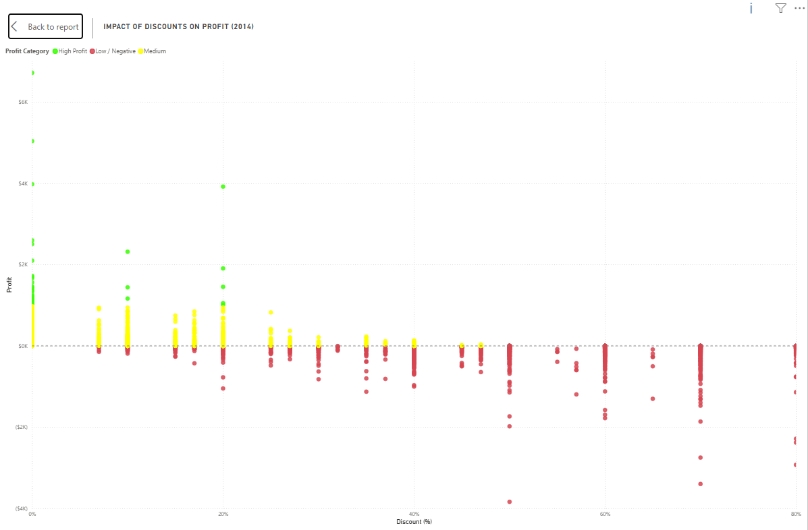

# 📊 Analyze

## 🎯 Objective

The objective of this phase was to analyze the prepared dataset and transform it into meaningful business insights. Using SQL Server for data validation and Power BI for interactive analysis, the data was explored to identify sales trends, profitability patterns, customer behavior, and opportunities for business improvement.

---

## ❓ Business Questions

The analysis was conducted to answer a set of key business questions that support strategic decision-making. These questions guided both the SQL analysis and the development of the Power BI dashboard.

- How are sales and profit evolving over time?
- Which markets generate the highest revenue?
- Which product categories are the most profitable?
- Which products generate the highest sales?
- Which customer segments contribute the most revenue?
- How do discounts affect profitability?
- Which shipping methods are most frequently used?
- Which regions require additional attention?

---

## 📈 Analysis Process

The analysis was performed in two stages. SQL Server was used to validate and explore the data, while Power BI was used to build interactive visualizations and business metrics.

### SQL Analysis

SQL queries were developed to validate the data model and calculate key performance indicators before creating the dashboard. This step ensured data accuracy and consistency throughout the project.

The SQL analysis included:

- Sales and Profit by Year
- Sales by Market
- Profit by Category
- Top-Selling Products
- Customer Segment Performance
- Shipping Mode Distribution
- Discount Impact Analysis

### Power BI Analysis

After validating the dataset in SQL Server, Power BI was used to create interactive visualizations and DAX measures that transformed the data into actionable business insights.

The dashboard includes:

- Executive KPIs
- Year-over-Year comparisons
- Market and regional analysis
- Product performance
- Customer segmentation
- Discount impact analysis
- Shipping mode distribution

## Dashboard Preview

    

<i>gif 1. Dashboard - Executive Overview slide. </i>

    

<i>gif 2. Dashboard - Business Insights slide. </i>

---

## 🔎 Key Findings

The analysis revealed several relevant patterns across sales, profitability, markets, products, and discounts.

### Sales & Profitability

- Total sales reached approximately **$6.03M** across the analyzed period.
- Profit reached approximately **$504K** in 2014.
- Overall profit margin was approximately **11.72%** in 2014.
- Sales increased compared with the previous year, while profitability also showed positive growth.

### Market Performance

- **APAC** was the strongest market by sales in 2014.
- The United States remained one of the largest contributors to total sales.
- Several regions showed significantly lower sales and were identified as areas requiring attention.

### Product & Category Performance

- Technology generated the highest share of total profit.
- A small group of products accounted for a significant portion of sales.
- Product performance varied considerably across categories.

### Discount Impact

- Higher discount levels were generally associated with lower profitability.
- The analysis identified high-discount transactions that may require closer attention.

    

<i>Image 1. Dashboard - Impact of Discounts on Profit (2014). </i>

---

## 💡 Business Insights

The analysis highlights three main areas that could influence business performance:

### 1. Profitability and Discounts

High discount levels were frequently associated with negative or reduced profitability. This suggests that discount strategies should be monitored carefully to avoid sacrificing profit margins for additional sales volume.

### 2. Market Performance

Sales performance varied considerably across markets and regions. While APAC and the United States represented strong contributors to overall sales, several regions generated significantly lower revenue and may require targeted strategies.

### 3. Product & Category Performance

Technology was the strongest contributor to total profit, highlighting the importance of maintaining strong performance in high-margin categories while identifying opportunities to improve weaker product segments.

---

## 🎯 Outcome

The analysis transformed the prepared data into measurable business insights and provided the foundation for the final Power BI dashboard.

The identified trends, performance gaps, and profitability patterns were used to determine which KPIs, visualizations, and comparisons should be included in the final dashboard.