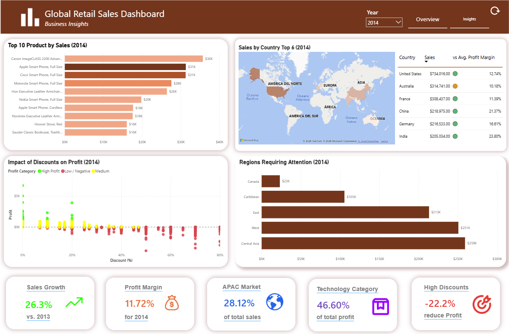

# Share

## Objective

The objective of this phase was to communicate the key findings through an interactive Power BI dashboard designed for clear and efficient business decision-making.

---

## Dashboard Design

The dashboard was designed to provide an executive-level overview while allowing users to explore sales, profitability, market, product, and regional performance.

Key design elements include:

- Interactive year filtering
- Dynamic KPI cards
- Year-over-Year comparisons
- Market and country performance analysis
- Product and category rankings
- Discount impact visualization
- Regional performance monitoring
- Consistent visual hierarchy and formatting

    

<i>Figure 1. Executive Overview Dashboard.</i>

    

<i>Figure 2. Business Insights Dashboard.</i>

---

## Key Visualizations

The dashboard combines several visualizations to communicate the most relevant business metrics and performance patterns.

- **KPI Cards:** Provide a quick overview of Sales, Profit, Profit Margin, Orders, and Customers.
- **Trend Analysis:** Shows how sales and profit evolve over time, including Year-over-Year comparisons.
- **Market & Regional Analysis:** Highlights performance differences across markets, countries, and regions.
- **Product & Category Analysis:** Identifies top-performing products and categories by sales and profitability.
- **Discount Analysis:** Illustrates the relationship between discount levels and profit.
- **Ranked Matrix:** Highlights regions requiring attention based on sales and profitability indicators.

    

<i>Figure 3. Business Insights slide.</i>

---

## Interactive Features

The dashboard was designed to allow users to explore the data dynamically and compare performance across different periods and business dimensions.

Key interactive features include:

- **Year Filter:** Updates the dashboard based on the selected year.
- **Dynamic KPIs:** Sales, Profit, Profit Margin, and Orders update automatically according to the selected period.
- **Year-over-Year Comparisons:** KPIs indicate whether performance increased or decreased compared with the previous year.
- **Dynamic Titles:** Visual titles update according to the selected year.
- **Cross-Filtering:** Selecting elements within visualizations filters related data across the dashboard.

---

## Communication Approach

The dashboard was designed to present complex data in a clear and accessible format for business users. Key performance indicators are displayed prominently, while interactive visualizations allow users to move from a high-level overview to more detailed performance analysis.

The combination of dynamic KPIs, trends, rankings, and geographic analysis helps users quickly identify performance changes and areas that require further attention.
